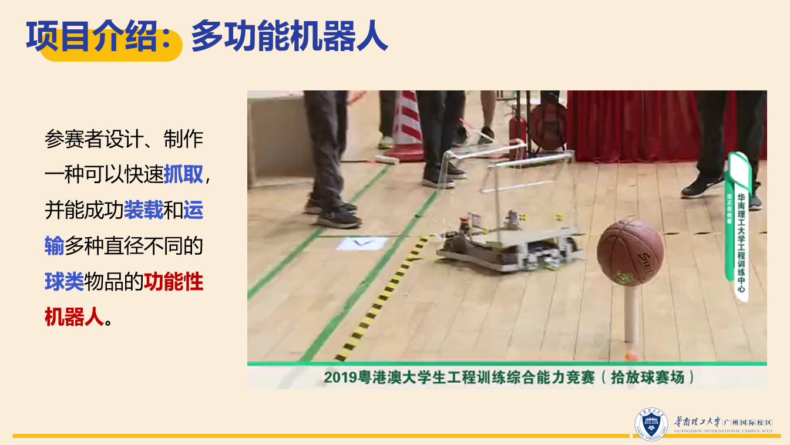
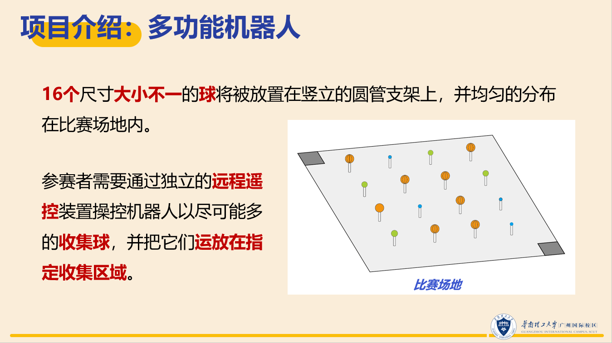
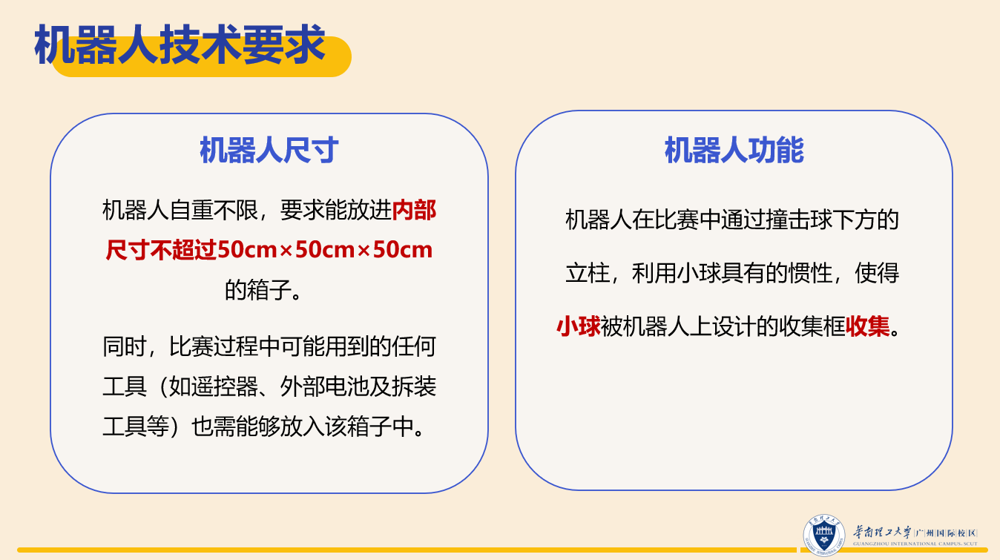
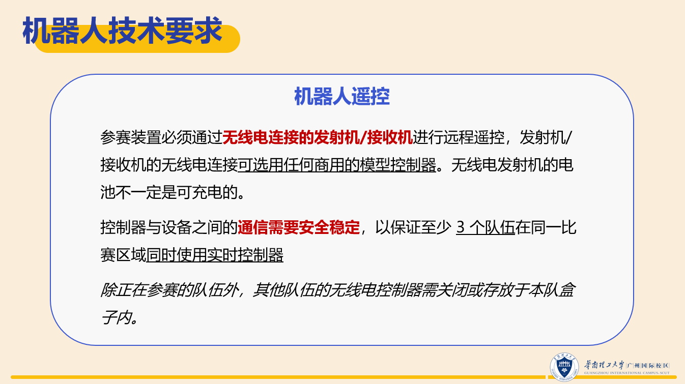
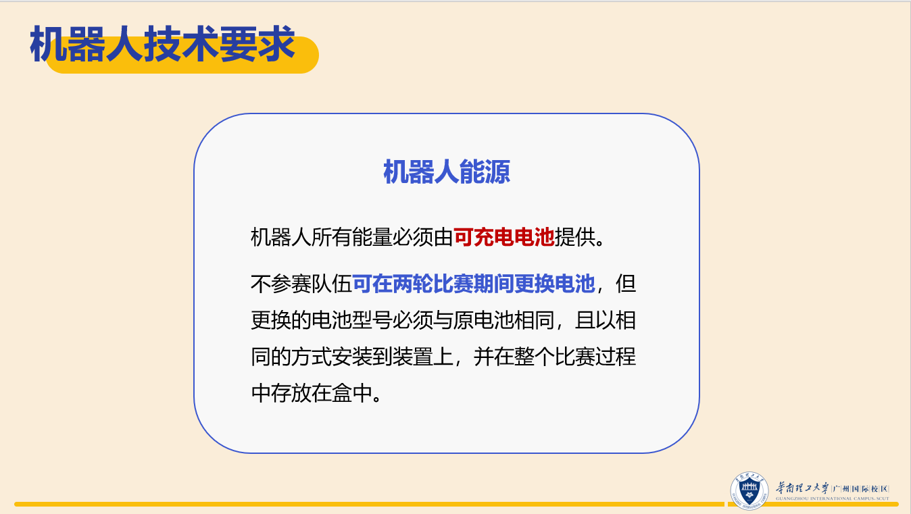
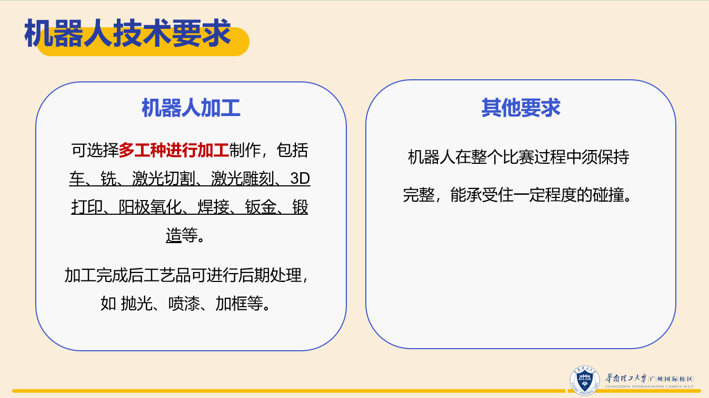
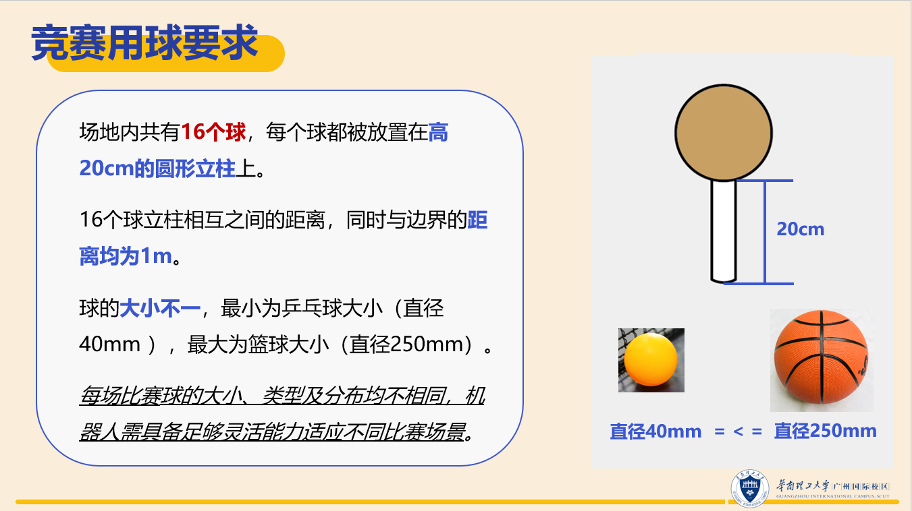
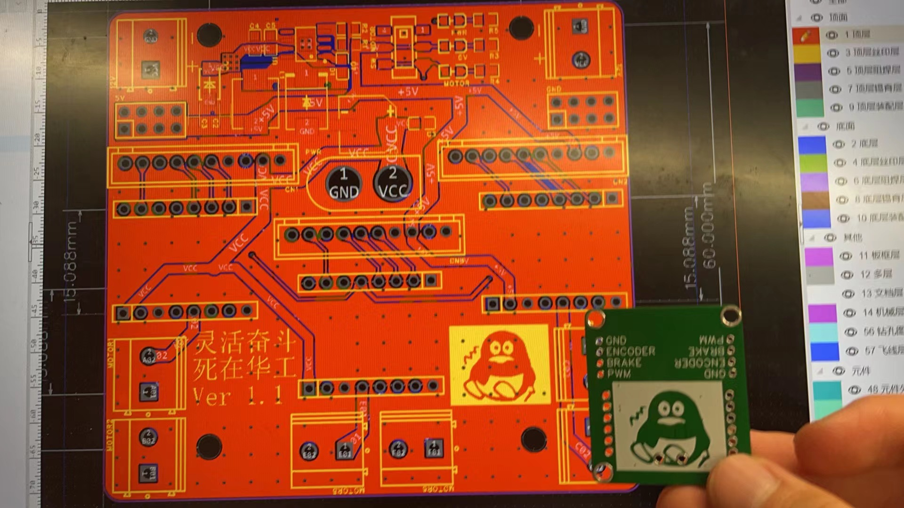

本开源项目包含华工国际21级机器人工程专业**灵活奋斗-死在华工组**于2021级本科生**工程训练分散项目多功能机器人（金工实习）** 过程中创造的相关文件。

我们于2023年5月30号比赛后自愿将本组在本课程项目中创造的所有文件（机械结构、电路设计、控制代码和宣传海报等文件）开源分享出来，供同届同学们参考和交流，也为以后的学弟学妹提供一份参考，欢迎同学们和全社会指正。

# 项目背景

华南理工大学广州国际校区吴贤铭智能工程学院2021级本科生工程训练课程（或称金工实习）在分散实训阶段要求学生们以队伍的形式合力制作一台智能车，实现拾球并放置到指定区域的功能。

本项目的介绍和规则如下：

（资源来源于老师发的比赛规则文件）

# 如何使用

文件夹为“mechanics”“electrics”“software”和“propaganda”，将文件下载到本地即可用合适的软件打开。

机械结构可能会有报错，电路图里可能有一些网格标签，程序是用 Arduino 写的，其中可能会有意义不明的代码，都是屎山对不起5555……

电路图中会有可爱的表情包，这不是屎山！

# 参与贡献方式

鼓励提 Issue 或者 PR。

亦可发邮件到 mengyanggao.public@outlook.com

# 开源协议

mechanics,electrics and propaganda 按照 CC 4.0 BY-NC 协议发放。 This work is licensed under a <a rel="license" href="http://creativecommons.org/licenses/by-nc/4.0/">Creative Commons Attribution-NonCommercial 4.0 International License</a>.

software 按照 [GNU](https://github.com/ksDreamer/-SCUT-2023-Engineering-Innovation-Training/blob/main/LICENSE) 协议发放

# 成员

灵活奋斗-死在华工组：

费菁皓、武宇航、高梦扬、温欣怡

2023年6月2日

